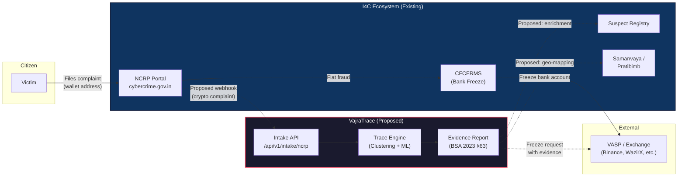
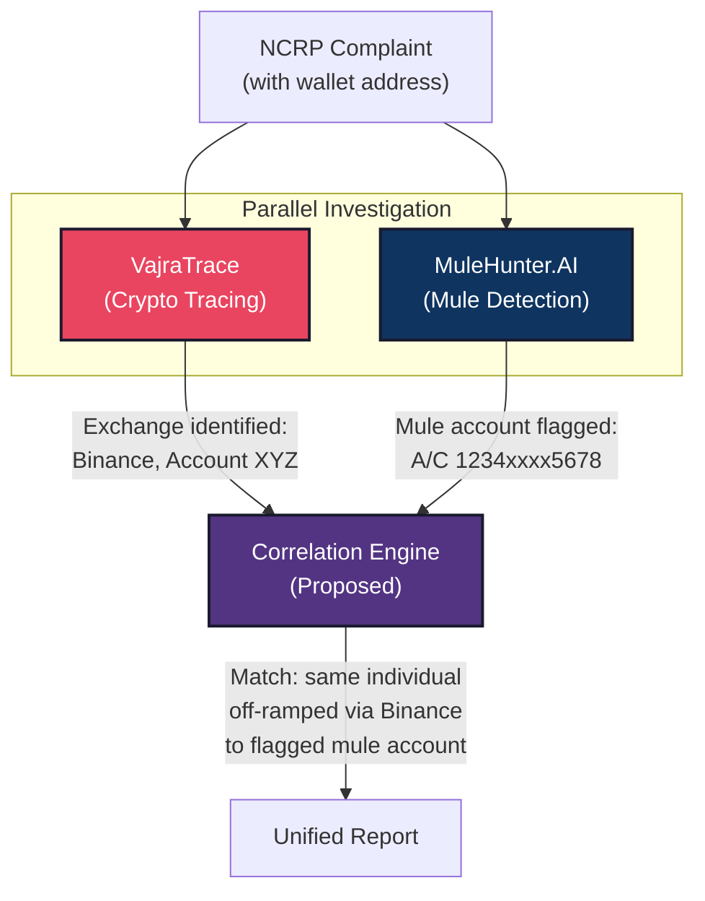
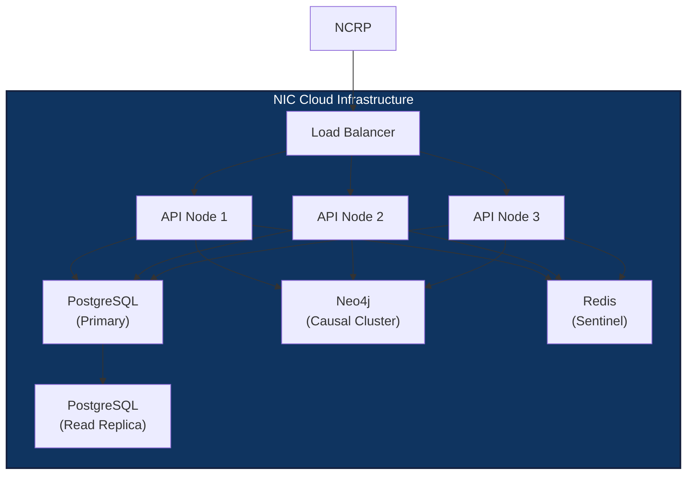

# VajraTrace × I4C Integration Roadmap

> **SIH 2026 · PS 26183 · Ministry of Home Affairs / I4C**
> Real-Time Identification of Fraud-Linked Cryptocurrency Exchanges from
> Victim-Reported Suspect Wallet Addresses through Automated Blockchain Analytics

**Version:** 1.0.0
**Date:** 2026-09-11
**Author:** Team Servidor

> [!CAUTION]
> **PROPOSED INTEGRATION — NOT A LIVE CONNECTION**
>
> This document describes a *proposed* architectural integration between
> VajraTrace and existing I4C systems. No live connection, API access, or
> data exchange with NCRP, CFCFRMS, Samanvaya, or any government system
> exists today. All webhook schemas, data mappings, and integration flows
> described herein are our recommended design for future implementation,
> subject to I4C's technical review and approval.

---

## 1. Overview — VajraTrace in the I4C Ecosystem

### 1.1 The Problem Gap

The Indian Cybercrime Coordination Centre (I4C), established under MHA
(scheme approved 05 October 2018, dedicated to the nation 10 January 2020,
upgraded to an Attached Office of MHA effective 01 July 2024), operates
the **National Cyber Crime Reporting Portal (NCRP)** at
[cybercrime.gov.in](https://cybercrime.gov.in) and the **1930 helpline**
for financial cyber fraud reporting.

The **Citizen Financial Cyber Fraud Reporting and Management System
(CFCFRMS)** integrates with banks and financial institutions to freeze
fraudulent fiat transactions within the "golden hour." However, when
fraud proceeds flow through **cryptocurrency** — a pattern increasingly
seen in pig-butchering scams, romance fraud, and investment fraud — the
existing CFCFRMS pipeline has no mechanism to:

1. Trace the suspect wallet address across blockchain networks
2. Identify the VASP/exchange where funds were off-ramped to fiat
3. Generate court-admissible evidence linking the wallet to a known entity

**VajraTrace fills this gap** — specifically for the crypto-wallet
segment of the fraud chain.

### 1.2 System Integration Diagram (Proposed)



> **Reading the diagram:**
> - **Solid arrows** = existing data flows in the I4C ecosystem
> - **Dashed arrows** = proposed integration points for VajraTrace

### 1.3 Positioning: Complementary, Not Competing

VajraTrace does **not** replace any existing I4C system. It adds a
dedicated **blockchain analytics layer** that currently does not exist
in the I4C stack:

| Capability | CFCFRMS (Existing) | VajraTrace (Proposed) |
|---|---|---|
| Bank account freeze | ✅ Real-time | ❌ Not applicable |
| Crypto wallet tracing | ❌ Not available | ✅ BTC, ETH, TRON |
| VASP/exchange identification | ❌ Not available | ✅ Automated attribution |
| Cross-chain bridge detection | ❌ Not available | ✅ ETH↔TRON correlation |
| Court-admissible evidence chain | ✅ For bank records | ✅ For blockchain records |

---

## 2. Proposed Webhook: NCRP → VajraTrace

### 2.1 Trigger Condition

When a citizen files a **Financial Fraud** complaint on NCRP
(cybercrime.gov.in) and includes a **cryptocurrency wallet address** as
a suspect identifier — either in the complaint text or via the
"Report Suspect" facility — the NCRP system would send a webhook
to VajraTrace.

> [!NOTE]
> NCRP's existing Suspect Repository already accepts identifiers such as
> mobile numbers, email IDs, account numbers, and URLs. A crypto wallet
> address field would be a natural extension of this model.

### 2.2 Webhook Endpoint

```
POST /api/v1/intake/ncrp
Content-Type: application/json
Authorization: Bearer <API_KEY>
X-NCRP-Signature: sha256=<HMAC_SHA256_of_body>
```

### 2.3 Request Schema

```json
{
    "complaint_id": "NCRP/2026/KA/00012345",
    "wallet_address": "TN7gR7mBPsZxYi2qVz9JfXKp3Y5ghQnRrS",
    "chain_hint": "TRON",
    "reported_amount": {
        "value": 250000.00,
        "currency": "INR"
    },
    "fraud_type": "INVESTMENT_FRAUD",
    "complainant_ref": "CMP-2026-0987654",
    "timestamp": "2026-09-10T14:30:00+05:30",
    "source_state": "KARNATAKA",
    "priority": "HIGH",
    "metadata": {
        "filed_via": "NCRP_WEB",
        "linked_fir": null,
        "linked_1930_ticket": "1930-KA-20260910-4567"
    }
}
```

**Field definitions:**

| Field | Type | Required | Description |
|---|---|---|---|
| `complaint_id` | string | ✅ | NCRP complaint reference number |
| `wallet_address` | string | ✅ | Suspect crypto wallet address (max 128 chars) |
| `chain_hint` | enum | ❌ | `"BTC"`, `"ETH"`, `"TRON"`, or `null` for auto-detect |
| `reported_amount` | object | ❌ | Amount reported lost by victim |
| `reported_amount.value` | number | — | Monetary value |
| `reported_amount.currency` | string | — | ISO 4217 currency code (default: `"INR"`) |
| `fraud_type` | enum | ✅ | See §2.4 for enum values |
| `complainant_ref` | string | ❌ | De-identified complainant reference (no PII) |
| `timestamp` | ISO 8601 | ✅ | When the complaint was filed |
| `source_state` | string | ❌ | State/UT of the complainant |
| `priority` | enum | ❌ | `"LOW"`, `"MEDIUM"`, `"HIGH"`, `"CRITICAL"` |
| `metadata` | object | ❌ | Additional context from NCRP |

### 2.4 Fraud Type Enum

These map to NCRP's existing complaint categories under "Financial Fraud":

| Value | NCRP Category |
|---|---|
| `INVESTMENT_FRAUD` | Online Investment Fraud / Crypto Trading Fraud |
| `PIG_BUTCHERING` | Part-time Job Fraud / Task-based Scam |
| `ROMANCE_SCAM` | Matrimonial / Dating Fraud |
| `RANSOMWARE` | Ransomware / Cyber Extortion |
| `SEXTORTION` | Sextortion |
| `IMPERSONATION` | Customer Care / KYC Fraud |
| `OTHER` | Other Financial Fraud |

### 2.5 Response Schema

**Success — `202 Accepted`:**

```json
{
    "status": "ACCEPTED",
    "trace_id": "a1b2c3d4-e5f6-7890-abcd-ef1234567890",
    "complaint_id": "NCRP/2026/KA/00012345",
    "estimated_completion_seconds": 45,
    "poll_url": "/api/v1/trace/a1b2c3d4-e5f6-7890-abcd-ef1234567890",
    "callback_url_registered": true
}
```

**VajraTrace then:**

1. Auto-starts the trace pipeline (ingest → cluster → attribute → score)
2. On completion, sends results back via a **callback webhook** to the
   NCRP system (see §2.6)

### 2.6 Callback: VajraTrace → NCRP (Result Delivery)

Once the trace completes (~30–60 seconds), VajraTrace would POST
results back to an NCRP callback endpoint:

```
POST <NCRP_CALLBACK_URL>/api/v1/crypto-trace-result
Content-Type: application/json
Authorization: Bearer <NCRP_API_KEY>
X-VajraTrace-Signature: sha256=<HMAC_SHA256_of_body>
```

```json
{
    "complaint_id": "NCRP/2026/KA/00012345",
    "trace_id": "a1b2c3d4-e5f6-7890-abcd-ef1234567890",
    "status": "COMPLETED",
    "result": {
        "reported_address": "TN7gR7mBPsZxYi2qVz9JfXKp3Y5ghQnRrS",
        "reported_chain": "TRON",
        "attributed_vasp": "Binance",
        "entity_type": "EXCHANGE",
        "confidence": 0.87,
        "risk_score": 0.72,
        "risk_tier": "HIGH",
        "typology": "pig_butchering",
        "sanctions_match": false,
        "cluster_size": 14,
        "total_value_traced_usd": 52340.50,
        "bridge_hops": [
            {
                "from_chain": "ETH",
                "to_chain": "TRON",
                "amount_usd": 15200.00,
                "confidence": 0.91
            }
        ],
        "evidence_hash": "sha256:e3b0c44298fc1c14...",
        "report_download_url": "/api/v1/reports/a1b2c3d4-.../download"
    },
    "completed_at": "2026-09-10T14:30:47+05:30"
}
```

### 2.7 Webhook Security

| Mechanism | Detail |
|---|---|
| **Authentication** | Bearer token (API key) in `Authorization` header |
| **Integrity** | HMAC-SHA256 signature of request body in `X-*-Signature` header |
| **Transport** | TLS 1.2+ required (HTTPS only) |
| **IP allow-listing** | VajraTrace deployed on NIC infrastructure would use NIC IP ranges |
| **Rate limiting** | 100 requests/minute per API key |
| **Idempotency** | Duplicate `complaint_id` returns existing `trace_id` (no re-processing) |

---

## 3. Output Mapping: VajraTrace → Suspect Registry / Samanvaya

### 3.1 Suspect Registry Integration

NCRP's [Suspect Repository](https://cybercrime.gov.in/Webform/Webform/suspect_search_repository.aspx)
allows citizens and law enforcement to search identifiers (mobile numbers,
emails, bank accounts, URLs) for linkages to known cyber criminals.
VajraTrace's output would enrich this registry with **crypto-specific
suspect data.**

**Proposed field mapping:**

| VajraTrace Output | → | Suspect Registry Field | Notes |
|---|---|---|---|
| `wallet_address` | → | `suspect_identifier` | New identifier type: `CRYPTO_WALLET` |
| `chain` | → | `identifier_subtype` | `BTC`, `ETH`, `TRON` |
| `attributed_vasp` | → | `linked_institution` | The exchange/VASP the wallet belongs to |
| `entity_type` | → | `institution_type` | `EXCHANGE`, `MIXER`, `P2P`, etc. |
| `risk_score` (0.0–1.0) | → | `risk_tier` | Mapped: ≥0.7 → `HIGH`, 0.4–0.7 → `MEDIUM`, <0.4 → `LOW` |
| `cluster_size` | → | `linked_identifiers_count` | Number of co-owned addresses in the cluster |
| `evidence_hash` | → | `supporting_evidence` | SHA-256 hash of the tamper-proof evidence chain |
| `sanctions_match` | → | `sanctions_flag` | Boolean: OFAC SDN list match |
| `typology` | → | `fraud_category` | Maps to existing NCRP categories |
| `complaint_id` | → | `source_complaint` | Back-reference to originating NCRP complaint |

**Example: What a cyber cell officer would see in the Suspect Registry:**

```
━━━━━━━━━━━━━━━━━━━━━━━━━━━━━━━━━━━━━━━━━━━━━━━━━━━━
 SUSPECT IDENTIFIER: TN7gR7mBPsZxYi2qVz9JfXKp3Y5ghQnRrS
 TYPE:               Crypto Wallet (TRON)
 RISK TIER:          ██████████ HIGH (0.72)
 LINKED TO:          Binance (Exchange)
 CLUSTER:            14 related wallets identified
 FRAUD TYPE:         Investment Fraud (Pig Butchering)
 SANCTIONS:          No OFAC match
 LINKED COMPLAINTS:  3 complaints across KA, MH, DL
 EVIDENCE:           SHA-256: e3b0c44298fc1c14...
 LAST UPDATED:       10 Sep 2026, 14:30 IST
━━━━━━━━━━━━━━━━━━━━━━━━━━━━━━━━━━━━━━━━━━━━━━━━━━━━
```

### 3.2 Samanvaya / Pratibimb Integration

I4C's **Samanvaya** platform enables inter-state coordination between
law enforcement agencies. **Pratibimb** provides geographic mapping and
pattern visualization of cybercrime.

VajraTrace's output would enrich these platforms as follows:

**Geographic correlation data:**

```json
{
    "trace_id": "a1b2c3d4-...",
    "complaint_id": "NCRP/2026/KA/00012345",
    "source_state": "KARNATAKA",
    "wallet_cluster": {
        "cluster_id": "c1d2e3f4-...",
        "addresses": 14,
        "chains": ["ETH", "TRON"],
        "attributed_entity": "Binance",
        "total_value_usd": 52340.50
    },
    "linked_complaints": [
        {"complaint_id": "NCRP/2026/MH/00098765", "state": "MAHARASHTRA"},
        {"complaint_id": "NCRP/2026/DL/00054321", "state": "DELHI"}
    ],
    "cross_state_pattern": true,
    "typology": "pig_butchering"
}
```

**How this enriches Samanvaya/Pratibimb:**

| Enrichment | Description |
|---|---|
| **Cross-state wallet clustering** | When the same wallet cluster appears in complaints from multiple states, Samanvaya can automatically flag it as an inter-state operation |
| **Geographic heat-mapping** | Pratibimb can overlay crypto fraud hotspots (by victim state) with off-ramp exchange locations |
| **Syndicate detection** | Multiple complaints linking to the same wallet cluster → probable organized fraud syndicate |
| **VASP concentration** | Identify which exchanges are most frequently used for off-ramping in specific regions |

---

## 4. Complementary to MuleHunter.AI

### 4.1 What MuleHunter.AI Does

**MuleHunter.AI** is an AI/ML-based model developed by the **Reserve Bank
Innovation Hub (RBIH)**, a wholly owned subsidiary of the Reserve Bank
of India. It is designed to detect **mule bank accounts** — accounts
used as intermediaries to layer and launder fraud proceeds through the
traditional banking system.

MuleHunter.AI operates on **bank-side data**: transaction patterns, account
age, fund flow velocity, and behavioural anomalies within fiat banking
infrastructure.

### 4.2 What VajraTrace Does

VajraTrace operates on **blockchain-side data**: on-chain transactions,
address clustering, VASP attribution, cross-chain bridge hops, and
sanctions screening across public blockchain networks (Bitcoin, Ethereum,
TRON).

### 4.3 The Complete Fraud Chain

Modern crypto-enabled fraud follows this path:

```mermaid
flowchart LR
    subgraph Victim
        VP["Victim's\nBank Account"]
    end

    subgraph Crypto["Crypto Layer"]
        EX1["Exchange A\n(On-ramp)"]
        W1["Wallet 1"]
        W2["Wallet 2"]
        MX["Mixer /\nBridge"]
        W3["Wallet 3"]
        EX2["Exchange B\n(Off-ramp)"]
    end

    subgraph Fiat["Fiat Layer"]
        MULE1["Mule Account 1"]
        MULE2["Mule Account 2"]
        PERP["Perpetrator's\nAccount"]
    end

    VP -->|"₹ Transfer"| EX1
    EX1 --> W1
    W1 --> W2
    W2 --> MX
    MX --> W3
    W3 --> EX2
    EX2 -->|"₹ Withdrawal"| MULE1
    MULE1 --> MULE2
    MULE2 --> PERP

    style Crypto fill:#2d132c,stroke:#e94560,stroke-width:2px,color:#fff
    style Fiat fill:#0f3460,stroke:#1a1a2e,stroke-width:2px,color:#fff
```



| Fraud Chain Segment | Detection Tool | Data Source |
|---|---|---|
| **Mule bank accounts** (fiat layer) | MuleHunter.AI (RBIH) | Bank transaction data |
| **Crypto wallets + exchanges** (crypto layer) | VajraTrace | Public blockchain data |
| **Complete chain** (crypto → fiat off-ramp) | Both together | Combined view |

### 4.4 Proposed Architectural Integration



> [!IMPORTANT]
> **VajraTrace does not access bank data.** We operate exclusively on
> publicly available blockchain data. The proposed correlation with
> MuleHunter.AI would require a shared intelligence layer — potentially
> within I4C's infrastructure — that can link a VASP's KYC-linked bank
> account to a MuleHunter.AI-flagged mule account. **This is a proposed
> architectural integration, not a live connection.**

### 4.5 Combined Coverage Matrix

| Scenario | MuleHunter.AI Alone | VajraTrace Alone | Both Together |
|---|---|---|---|
| Victim → Bank → Mule Account | ✅ Detects mule | ❌ No visibility | ✅ |
| Victim → Exchange → Crypto → Exchange → Mule | ❌ Sees mule only | ✅ Traces full crypto path | ✅ Complete chain |
| Victim → Crypto → Cross-chain bridge → Exchange → Mule | ❌ | ✅ Detects bridge hop | ✅ Complete chain |
| Crypto → Mixer → Multiple off-ramps | ❌ | ✅ Identifies mixer + exits | ✅ |

---

## 5. Scaling Plan

### Phase 1: Hackathon Demonstration (Current)

| Aspect | Detail |
|---|---|
| **Input method** | Manual wallet address entry via web UI |
| **Blockchain APIs** | Free tiers: Etherscan, Blockchair, Mempool.space, TronScan |
| **Infrastructure** | Docker Compose on a single laptop |
| **Database** | PostgreSQL 16 + Neo4j 5 (local containers) |
| **Capacity** | ~50 traces/day (free API rate limits) |
| **Cost** | ₹0 (all free-tier APIs) |
| **Chains** | BTC, ETH, TRON |

---

### Phase 2: Pilot Deployment (Target: +3 months post-hackathon)

| Aspect | Detail |
|---|---|
| **Input method** | Proposed NCRP webhook (§2) + manual UI |
| **Blockchain APIs** | Dedicated API tiers (Etherscan Pro, Blockchair Premium) |
| **Infrastructure** | Single VM on NIC cloud (4 vCPU, 16GB RAM, 100GB SSD) |
| **Pilot scope** | 1 state cyber cell (e.g., Karnataka CID Cyber Crime) |
| **Capacity** | ~500 traces/day |
| **Est. cost per case** | ₹2–5 in API costs |
| **Integration** | Read-only enrichment to Suspect Registry |

**Pilot success criteria:**
- ≥70% attribution rate (wallet → named VASP/exchange)
- <60 second average trace time
- Evidence chain passes BSA 2023 §63 admissibility review
- Positive feedback from pilot cyber cell officers

---

### Phase 3: Production Deployment (Target: +6 months post-pilot)

| Aspect | Detail |
|---|---|
| **Input method** | Full NCRP webhook integration + bulk API |
| **Blockchain APIs** | Enterprise tier + direct node access for high-volume chains |
| **Infrastructure** | NIC cloud cluster (HA deployment: 3 API nodes, PG replica, Neo4j causal cluster) |
| **Scope** | All 36 state/UT cyber cells via Samanvaya |
| **Capacity** | ~10,000 traces/day |
| **Est. cost per case** | ₹1–3 (volume discounts on API tiers) |
| **Integration** | Full bidirectional: NCRP ↔ VajraTrace ↔ Suspect Registry ↔ Samanvaya |

**Production architecture:**



---

### Cost Summary

| Phase | Volume | API Cost/Case | Monthly Est. |
|---|---|---|---|
| Hackathon | ~50/day | ₹0 (free tier) | ₹0 |
| Pilot | ~500/day | ₹2–5 | ₹30,000–75,000 |
| Production | ~10,000/day | ₹1–3 | ₹3,00,000–9,00,000 |

> [!NOTE]
> API costs are primarily for blockchain data providers (Etherscan,
> Blockchair, etc.). If NIC/I4C operates its own blockchain nodes for
> BTC, ETH, and TRON, the per-case API cost drops to near ₹0, with
> costs shifting to infrastructure (node hosting: ~₹50,000/month for
> all three chains on NIC cloud).

---

## References

### I4C Systems (Verifiable Sources)

| System | Source |
|---|---|
| **I4C** — Indian Cybercrime Coordination Centre | [i4c.mha.gov.in/about.aspx](https://www.i4c.mha.gov.in/about.aspx) — Approved 05 Oct 2018, dedicated 10 Jan 2020, Attached Office from 01 Jul 2024 |
| **NCRP** — National Cyber Crime Reporting Portal | [cybercrime.gov.in](https://cybercrime.gov.in) — Portal for reporting cybercrime including Financial Fraud category |
| **1930 Helpline** | National helpline for reporting financial cyber fraud, integrated with CFCFRMS |
| **CFCFRMS** — Citizen Financial Cyber Fraud Reporting and Management System | Integrated with banks for real-time fund freeze; referenced in MHA Lok Sabha responses and PIB releases |
| **Suspect Repository** | [cybercrime.gov.in/Webform/suspect\_search\_repository.aspx](https://cybercrime.gov.in/Webform/Webform/suspect_search_repository.aspx) — Citizens can search mobile, email, account numbers, URLs for linkages to cyber criminals |
| **MuleHunter.AI** | Developed by Reserve Bank Innovation Hub (RBIH), a wholly owned subsidiary of RBI, for AI-based mule bank account detection |
| **I4C Verticals** | NCRP, NCTAU, NCEMU, JCCT, NCFL, NCTC, NCR&IC — per [i4c.mha.gov.in](https://www.i4c.mha.gov.in/about.aspx) |
| **NIC** — National Informatics Centre | I4C website designed, developed and hosted by NIC, Government of India |
| **Samanvaya** | I4C platform for inter-state law enforcement coordination on cybercrime |
| **Pratibimb** | I4C platform for geographic mapping and cybercrime pattern visualization |

### VajraTrace Technical References

| Component | Reference |
|---|---|
| Architecture Specification | [`docs/architecture.md`](file:///d:/SIH/vajratrace/docs/architecture.md) |
| API Route Contracts | [`docs/architecture.md` §3](file:///d:/SIH/vajratrace/docs/architecture.md#L452-L859) |
| PostgreSQL Schema | [`docs/architecture.md` §1](file:///d:/SIH/vajratrace/docs/architecture.md#L33-L321) |
| Neo4j Graph Model | [`docs/architecture.md` §2](file:///d:/SIH/vajratrace/docs/architecture.md#L325-L448) |
| Docker Compose | [`docker-compose.yml`](file:///d:/SIH/vajratrace/docker-compose.yml) |

---

> **Document Classification:** UNCLASSIFIED
> **Distribution:** SIH 2026 evaluation panel, I4C/MHA technical reviewers
> **Contact:** Team Servidor (SIH 2026)
