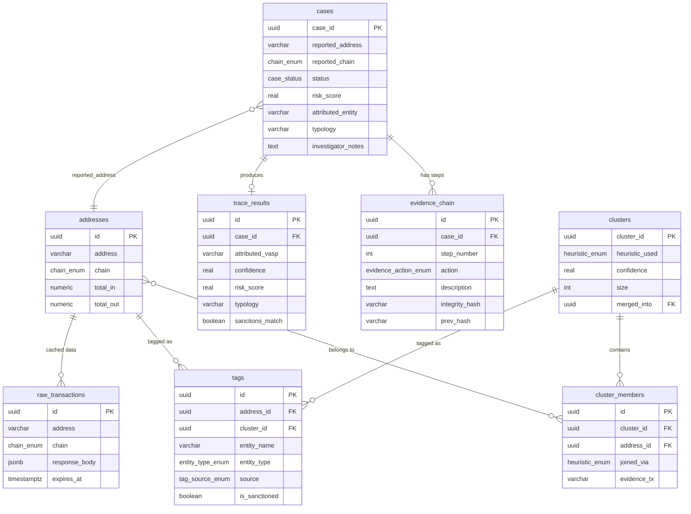
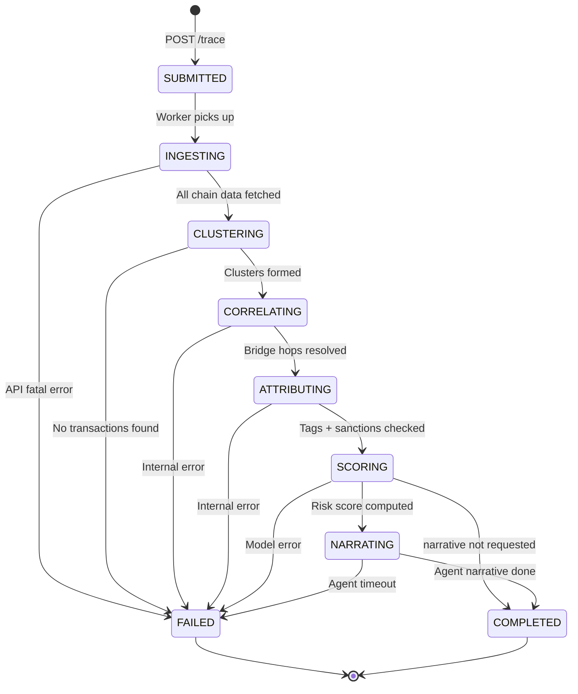

# VajraTrace — Architecture Specification

> **SIH 2026 · PS 26183 · Ministry of Home Affairs / I4C**
> Real-Time Identification of Fraud-Linked Cryptocurrency Exchanges from
> Victim-Reported Suspect Wallet Addresses through Automated Blockchain Analytics

**Version:** 1.0.0
**Date:** 2026-09-10
**Author:** Team Servidor

---

## Assumptions & Design Decisions

> [!IMPORTANT]
> Read this section first — every downstream schema choice traces back here.

| # | Assumption | Rationale |
|---|-----------|-----------|
| A1 | All monetary values are stored as `NUMERIC(38,18)` — the widest denomination across chains (ETH has 18 decimals, BTC has 8, TRON has 6). Application layer normalises display. | Avoids silent truncation; Postgres `NUMERIC` is arbitrary-precision. |
| A2 | `chain` is an enum `{BTC, ETH, TRON}`. Extend the enum when adding chains; no stringly-typed chain identifiers. | Constraint + index friendliness. |
| A3 | Addresses are stored **lowercase, checksummed for ETH (EIP-55 before lowering)** and raw for BTC/TRON. Max length 128 chars covers all three chains including Bech32m. | Prevents duplicate rows for mixed-case ETH addresses. |
| A4 | `raw_transactions.response_body` is `JSONB` not `JSON` — we need GIN-indexed queries into cached API payloads. | TTL-based cache invalidation needs fast lookups. |
| A5 | Cluster IDs are UUIDs, not serial ints. Clusters can merge; UUIDs avoid key-collision on merge. | Standard in entity-resolution systems. |
| A6 | Evidence chain is append-only, cryptographically chained (each row's `integrity_hash` covers the previous row's hash). This satisfies BSA 2023 § 63 for digital evidence admissibility. | Legal requirement — not optional. |
| A7 | Risk scores are `REAL` (0.0–1.0). The XGBoost model outputs a calibrated probability; we store it as-is plus the raw SHAP values as JSONB. | Explainability is a first-class citizen. |
| A8 | Neo4j is the **query** graph for visualization and path-finding. Postgres is the **system of record**. If they diverge, Postgres wins. | Single source of truth. |
| A9 | WebSocket messages use a discriminated-union envelope: `{"type": "...", "data": {...}}`. | Frontend can switch on `type` without guessing payload shape. |
| A10 | The Claude agent operates as a tool-use loop within a FastAPI background task. Tools are defined here; the orchestrator prompt is out of scope for this document. | Separation of concerns. |

---

## 1. PostgreSQL Schema

### 1.0 Prerequisites

```sql
-- Run once on the database
CREATE EXTENSION IF NOT EXISTS "pgcrypto";   -- gen_random_uuid()
CREATE EXTENSION IF NOT EXISTS "pg_trgm";    -- trigram index for tag search

CREATE TYPE chain_enum AS ENUM ('BTC', 'ETH', 'TRON');

CREATE TYPE case_status AS ENUM (
    'SUBMITTED',        -- victim just filed
    'INGESTING',        -- fetching on-chain data
    'CLUSTERING',       -- running heuristics
    'CORRELATING',      -- cross-chain bridge matching
    'ATTRIBUTING',      -- tag + sanctions lookup
    'SCORING',          -- ML risk scoring
    'NARRATING',        -- Claude agent narrative (optional)
    'COMPLETED',        -- done
    'FAILED'            -- pipeline error
);

CREATE TYPE heuristic_enum AS ENUM (
    'MULTI_INPUT',          -- common-input-ownership
    'CHANGE_ADDRESS',       -- change-address detection
    'PEELING_CHAIN',        -- peel-chain pattern
    'DEPOSIT_REUSE',        -- exchange deposit address reuse
    'TIMING_AMOUNT_BRIDGE', -- cross-chain bridge correlation
    'MANUAL'                -- analyst override
);

CREATE TYPE entity_type_enum AS ENUM (
    'EXCHANGE',
    'VASP',
    'MIXER',
    'DARKNET_MARKET',
    'RANSOMWARE',
    'SCAM',
    'SANCTIONED',
    'P2P',
    'DEFI_PROTOCOL',
    'BRIDGE',
    'UNKNOWN'
);

CREATE TYPE tag_source_enum AS ENUM (
    'OFAC_SDN',
    'GRAPHSENSE_TAGPACK',
    'MANUAL_CURATED',
    'COMMUNITY',
    'ML_PREDICTED'
);

CREATE TYPE evidence_action_enum AS ENUM (
    'FETCH_TX_HISTORY',
    'CLUSTER_ADDRESS',
    'DETECT_BRIDGE_HOP',
    'TAG_LOOKUP',
    'SANCTIONS_CHECK',
    'RISK_SCORE',
    'AGENT_NARRATION',
    'REPORT_GENERATED'
);
```

---

### 1.1 `raw_transactions` — Cached API Responses with TTL

```sql
CREATE TABLE raw_transactions (
    id              UUID PRIMARY KEY DEFAULT gen_random_uuid(),
    address         VARCHAR(128)    NOT NULL,
    chain           chain_enum      NOT NULL,
    api_source      VARCHAR(64)     NOT NULL,          -- e.g. 'etherscan', 'blockchair', 'mempool_space', 'tronscan'
    endpoint        VARCHAR(256)    NOT NULL,          -- API endpoint path for cache-key dedup
    response_body   JSONB           NOT NULL,
    fetched_at      TIMESTAMPTZ     NOT NULL DEFAULT now(),
    expires_at      TIMESTAMPTZ     NOT NULL,          -- fetched_at + TTL (default 1 hour)
    http_status     SMALLINT        NOT NULL DEFAULT 200,
    
    -- Deduplication: same address+chain+endpoint = same cache entry
    CONSTRAINT uq_raw_cache UNIQUE (address, chain, api_source, endpoint)
);

-- Fast lookups for cache-hit checks
CREATE INDEX idx_raw_tx_lookup ON raw_transactions (address, chain, api_source, endpoint);
-- Periodic cleanup of expired rows
CREATE INDEX idx_raw_tx_expiry ON raw_transactions (expires_at);

COMMENT ON TABLE raw_transactions IS 
    'Immutable cache of upstream blockchain API responses. '
    'A background job DELETEs rows WHERE expires_at < now() every 15 minutes.';
```

---

### 1.2 `addresses`

```sql
CREATE TABLE addresses (
    id              UUID PRIMARY KEY DEFAULT gen_random_uuid(),
    address         VARCHAR(128)    NOT NULL,
    chain           chain_enum      NOT NULL,
    first_seen      TIMESTAMPTZ,                       -- earliest on-chain tx timestamp
    last_seen       TIMESTAMPTZ,                       -- latest on-chain tx timestamp
    total_in        NUMERIC(38,18)  NOT NULL DEFAULT 0,
    total_out       NUMERIC(38,18)  NOT NULL DEFAULT 0,
    tx_count        INTEGER         NOT NULL DEFAULT 0,
    is_contract     BOOLEAN         NOT NULL DEFAULT FALSE,  -- ETH/TRON only
    created_at      TIMESTAMPTZ     NOT NULL DEFAULT now(),
    updated_at      TIMESTAMPTZ     NOT NULL DEFAULT now(),
    
    CONSTRAINT uq_address_chain UNIQUE (address, chain)
);

CREATE INDEX idx_addr_chain ON addresses (chain);
CREATE INDEX idx_addr_last_seen ON addresses (last_seen DESC);
```

---

### 1.3 `clusters`

```sql
CREATE TABLE clusters (
    cluster_id      UUID PRIMARY KEY DEFAULT gen_random_uuid(),
    label           VARCHAR(256),                      -- human-readable label if attributed
    heuristic_used  heuristic_enum  NOT NULL,
    confidence      REAL            NOT NULL CHECK (confidence >= 0 AND confidence <= 1),
    size            INTEGER         NOT NULL DEFAULT 0,  -- denorm: COUNT of cluster_members
    created_at      TIMESTAMPTZ     NOT NULL DEFAULT now(),
    updated_at      TIMESTAMPTZ     NOT NULL DEFAULT now(),
    merged_into     UUID            REFERENCES clusters(cluster_id) ON DELETE SET NULL
                                                       -- NULL = active cluster; set when merged
);

CREATE INDEX idx_cluster_heuristic ON clusters (heuristic_used);
CREATE INDEX idx_cluster_merged ON clusters (merged_into) WHERE merged_into IS NOT NULL;

COMMENT ON COLUMN clusters.merged_into IS 
    'When two clusters are found to belong to the same entity, the smaller '
    'cluster sets merged_into = larger cluster_id. Query active clusters with '
    'WHERE merged_into IS NULL.';
```

---

### 1.4 `cluster_members` — Cluster ↔ Address Mapping

```sql
CREATE TABLE cluster_members (
    id              UUID PRIMARY KEY DEFAULT gen_random_uuid(),
    cluster_id      UUID            NOT NULL REFERENCES clusters(cluster_id) ON DELETE CASCADE,
    address_id      UUID            NOT NULL REFERENCES addresses(id) ON DELETE CASCADE,
    joined_via      heuristic_enum  NOT NULL,          -- which heuristic linked this address
    evidence_tx     VARCHAR(128),                      -- the tx_hash that proved co-ownership
    confidence      REAL            NOT NULL CHECK (confidence >= 0 AND confidence <= 1),
    added_at        TIMESTAMPTZ     NOT NULL DEFAULT now(),
    
    CONSTRAINT uq_cluster_address UNIQUE (cluster_id, address_id)
);

CREATE INDEX idx_cm_cluster ON cluster_members (cluster_id);
CREATE INDEX idx_cm_address ON cluster_members (address_id);

COMMENT ON COLUMN cluster_members.evidence_tx IS 
    'The transaction hash that justified adding this address to the cluster. '
    'For MULTI_INPUT, this is the tx where both addresses appeared as inputs.';
```

---

### 1.5 `tags` — Address/Cluster → Entity Attribution

```sql
CREATE TABLE tags (
    id              UUID PRIMARY KEY DEFAULT gen_random_uuid(),
    address_id      UUID            REFERENCES addresses(id) ON DELETE CASCADE,
    cluster_id      UUID            REFERENCES clusters(cluster_id) ON DELETE CASCADE,
    entity_name     VARCHAR(256)    NOT NULL,          -- e.g. 'Binance', 'Hydra Market'
    entity_type     entity_type_enum NOT NULL,
    source          tag_source_enum NOT NULL,
    source_url      TEXT,                              -- link to OFAC listing, TagPack, etc.
    confidence      REAL            NOT NULL CHECK (confidence >= 0 AND confidence <= 1),
    is_sanctioned   BOOLEAN         NOT NULL DEFAULT FALSE,
    created_at      TIMESTAMPTZ     NOT NULL DEFAULT now(),
    updated_at      TIMESTAMPTZ     NOT NULL DEFAULT now(),
    
    -- At least one of address_id or cluster_id must be set
    CONSTRAINT chk_tag_target CHECK (
        (address_id IS NOT NULL) OR (cluster_id IS NOT NULL)
    )
);

CREATE INDEX idx_tag_address ON tags (address_id) WHERE address_id IS NOT NULL;
CREATE INDEX idx_tag_cluster ON tags (cluster_id) WHERE cluster_id IS NOT NULL;
CREATE INDEX idx_tag_entity_name ON tags USING gin (entity_name gin_trgm_ops);
CREATE INDEX idx_tag_sanctioned ON tags (is_sanctioned) WHERE is_sanctioned = TRUE;
```

---

### 1.6 `cases`

```sql
CREATE TABLE cases (
    case_id             UUID PRIMARY KEY DEFAULT gen_random_uuid(),
    reported_address    VARCHAR(128)    NOT NULL,
    reported_chain      chain_enum      NOT NULL,
    status              case_status     NOT NULL DEFAULT 'SUBMITTED',
    risk_score          REAL            CHECK (risk_score IS NULL OR (risk_score >= 0 AND risk_score <= 1)),
    attributed_entity   VARCHAR(256),                  -- final VASP/exchange name if found
    typology            VARCHAR(128),                  -- e.g. 'pig_butchering', 'ransomware', 'romance_scam'
    investigator_notes  TEXT,
    submitted_by        VARCHAR(256),                  -- officer name / badge / email
    report_pdf_path     TEXT,                          -- S3 key or local path to generated PDF
    report_hash         VARCHAR(64),                   -- SHA-256 of the PDF for legal chain-of-custody
    created_at          TIMESTAMPTZ     NOT NULL DEFAULT now(),
    updated_at          TIMESTAMPTZ     NOT NULL DEFAULT now(),
    completed_at        TIMESTAMPTZ
);

CREATE INDEX idx_case_status ON cases (status);
CREATE INDEX idx_case_address ON cases (reported_address, reported_chain);
CREATE INDEX idx_case_created ON cases (created_at DESC);
```

---

### 1.7 `evidence_chain` — Append-Only Investigation Audit Trail

```sql
CREATE TABLE evidence_chain (
    id              UUID PRIMARY KEY DEFAULT gen_random_uuid(),
    case_id         UUID            NOT NULL REFERENCES cases(case_id) ON DELETE CASCADE,
    step_number     INTEGER         NOT NULL,
    action          evidence_action_enum NOT NULL,
    description     TEXT            NOT NULL,          -- human-readable: "Fetched 142 txs for 0xabc…"
    result_summary  TEXT,                              -- short outcome
    confidence      REAL            CHECK (confidence IS NULL OR (confidence >= 0 AND confidence <= 1)),
    raw_data        JSONB,                             -- full machine-readable payload
    shap_values     JSONB,                             -- SHAP explanation if action = RISK_SCORE
    prev_hash       VARCHAR(64),                       -- SHA-256 of previous row (NULL for step 0)
    integrity_hash  VARCHAR(64)     NOT NULL,          -- SHA-256(step_number || action || result || prev_hash)
    created_at      TIMESTAMPTZ     NOT NULL DEFAULT now(),
    
    CONSTRAINT uq_case_step UNIQUE (case_id, step_number)
);

CREATE INDEX idx_evidence_case ON evidence_chain (case_id, step_number);

COMMENT ON TABLE evidence_chain IS 
    'Append-only, hash-chained audit log satisfying BSA 2023 §63 requirements. '
    'Each row''s integrity_hash = SHA-256(step_number || action || result_summary || prev_hash). '
    'Tampering with any row breaks the chain. Application MUST enforce append-only semantics '
    '(no UPDATE, no DELETE on application layer; DB-level DELETE CASCADE is for case deletion only).';
```

---

### 1.8 `trace_results` — Final Attribution Output

```sql
CREATE TABLE trace_results (
    id                  UUID PRIMARY KEY DEFAULT gen_random_uuid(),
    case_id             UUID            NOT NULL REFERENCES cases(case_id) ON DELETE CASCADE,
    address_id          UUID            REFERENCES addresses(id),
    cluster_id          UUID            REFERENCES clusters(cluster_id),
    attributed_vasp     VARCHAR(256),                  -- resolved exchange/VASP name
    entity_type         entity_type_enum,
    confidence          REAL            NOT NULL CHECK (confidence >= 0 AND confidence <= 1),
    risk_score          REAL            NOT NULL CHECK (risk_score >= 0 AND risk_score <= 1),
    typology            VARCHAR(128),                  -- fraud typology classification
    shap_explanation    JSONB,                         -- top SHAP features for this score
    bridge_hops         JSONB,                         -- array of detected cross-chain hops
    sanctions_match     BOOLEAN         NOT NULL DEFAULT FALSE,
    sanctions_details   JSONB,                         -- OFAC SDN match details if any
    agent_narrative     TEXT,                           -- Claude agent's step-by-step explanation
    created_at          TIMESTAMPTZ     NOT NULL DEFAULT now(),
    
    CONSTRAINT uq_trace_case UNIQUE (case_id)          -- one final result per case
);

CREATE INDEX idx_trace_case ON trace_results (case_id);
CREATE INDEX idx_trace_vasp ON trace_results (attributed_vasp);
CREATE INDEX idx_trace_risk ON trace_results (risk_score DESC);
```

---

## 2. Neo4j Graph Model

### 2.1 Node Labels & Properties

```cypher
// ── Address ──
CREATE CONSTRAINT addr_unique IF NOT EXISTS
FOR (a:Address) REQUIRE (a.address, a.chain) IS UNIQUE;

// Properties:
// a.address       : String  — lowercased wallet address
// a.chain         : String  — "BTC" | "ETH" | "TRON"
// a.cluster_id    : String  — UUID of owning cluster (nullable)
// a.risk_score    : Float   — 0.0–1.0 (nullable until scored)
// a.label         : String  — entity name if tagged (nullable)
// a.is_sanctioned : Boolean — OFAC match flag
// a.total_in      : Float   — lifetime inflow (native units)
// a.total_out     : Float   — lifetime outflow (native units)
// a.first_seen    : DateTime
// a.last_seen     : DateTime


// ── Cluster ──
CREATE CONSTRAINT cluster_unique IF NOT EXISTS
FOR (c:Cluster) REQUIRE c.cluster_id IS UNIQUE;

// Properties:
// c.cluster_id    : String  — UUID
// c.size          : Integer — number of member addresses
// c.label         : String  — attributed entity name (nullable)
// c.entity_type   : String  — from entity_type_enum
// c.confidence    : Float   — clustering confidence 0.0–1.0
// c.heuristic     : String  — primary heuristic used
// c.risk_score    : Float   — aggregate risk (max of members)


// ── Transaction ──
CREATE CONSTRAINT tx_unique IF NOT EXISTS
FOR (t:Transaction) REQUIRE (t.tx_hash, t.chain) IS UNIQUE;

// Properties:
// t.tx_hash       : String  — transaction hash
// t.chain         : String  — "BTC" | "ETH" | "TRON"
// t.value         : Float   — transferred amount in native units
// t.value_usd     : Float   — USD value at time of tx (nullable)
// t.token         : String  — "BTC", "ETH", "TRX", "USDT", etc.
// t.timestamp     : DateTime
// t.block         : Integer — block number
// t.fee           : Float   — transaction fee in native units


// ── Entity ── (optional: for attributed VASP/exchange nodes)
CREATE CONSTRAINT entity_unique IF NOT EXISTS
FOR (e:Entity) REQUIRE e.name IS UNIQUE;

// Properties:
// e.name          : String  — "Binance", "WazirX", etc.
// e.entity_type   : String  — from entity_type_enum
// e.is_sanctioned : Boolean
// e.country       : String  — jurisdiction (nullable)
```

### 2.2 Relationship Types & Properties

```cypher
// ── SENT ──
// (sender:Address)-[:SENT {tx_hash, value, token, timestamp, block, chain}]->(t:Transaction)
// Represents an address being an input/sender in a transaction.

// ── RECEIVED ──
// (t:Transaction)-[:RECEIVED {value, token, output_index}]->(receiver:Address)
// Represents an address being an output/receiver in a transaction.

// ── BELONGS_TO_CLUSTER ──
// (a:Address)-[:BELONGS_TO_CLUSTER {
//     heuristic: String,       — which heuristic linked this
//     evidence_tx: String,     — tx_hash proving co-ownership
//     confidence: Float,       — 0.0–1.0
//     added_at: DateTime
// }]->(c:Cluster)

// ── BRIDGE_LINKED ──
// (t1:Transaction)-[:BRIDGE_LINKED {
//     source_chain: String,    — e.g. "ETH"
//     dest_chain: String,      — e.g. "TRON"
//     bridge_protocol: String, — e.g. "multichain", "allbridge" (nullable)
//     time_delta_seconds: Integer,  — seconds between t1 and t2
//     amount_delta_pct: Float,      — % difference in USD value
//     confidence: Float        — correlation confidence 0.0–1.0
// }]->(t2:Transaction)

// ── ATTRIBUTED_TO ──  (Cluster or Address → Entity)
// (c:Cluster)-[:ATTRIBUTED_TO {
//     source: String,          — "OFAC_SDN", "GRAPHSENSE_TAGPACK", etc.
//     confidence: Float,
//     tagged_at: DateTime
// }]->(e:Entity)

// (a:Address)-[:ATTRIBUTED_TO {...same props...}]->(e:Entity)
```

### 2.3 Indexes for Traversal Performance

```cypher
CREATE INDEX addr_chain_idx IF NOT EXISTS FOR (a:Address) ON (a.chain);
CREATE INDEX addr_risk_idx IF NOT EXISTS FOR (a:Address) ON (a.risk_score);
CREATE INDEX tx_timestamp_idx IF NOT EXISTS FOR (t:Transaction) ON (t.timestamp);
CREATE INDEX tx_chain_idx IF NOT EXISTS FOR (t:Transaction) ON (t.chain);
CREATE INDEX entity_type_idx IF NOT EXISTS FOR (e:Entity) ON (e.entity_type);
```

### 2.4 Example: Trace Query — Shortest Path from Victim Address to Exchange

```cypher
MATCH path = shortestPath(
    (victim:Address {address: $reported_address, chain: $chain})
    -[:SENT|RECEIVED|BRIDGE_LINKED*..15]-
    (dest:Address)
)
WHERE dest.label IS NOT NULL
RETURN path, dest.label AS exchange, length(path) AS hops
ORDER BY hops ASC
LIMIT 5;
```

---

## 3. FastAPI Route Contracts

> **Base URL:** `/api/v1`
> **Auth:** All endpoints require `Authorization: Bearer <JWT>` header (except WebSocket which uses query param `?token=`).
> **Content-Type:** `application/json` unless noted.

---

### 3.1 `POST /api/v1/trace` — Submit Wallet for Tracing

Starts an asynchronous trace pipeline. Returns immediately with a `trace_id` to poll.

**Request Body:**

```json
{
    "address": "0x1234abcd...",             // required, string, max 128 chars
    "chain": "ETH",                         // required, enum: "BTC" | "ETH" | "TRON"
    "depth": 3,                             // optional, int, default 3, max 6 — hop depth
    "include_agent_narrative": true,         // optional, bool, default false
    "submitted_by": "SI Ravi Kumar",         // optional, string — investigator name
    "notes": "Victim ref: NCRP/2026/12345"  // optional, string
}
```

**Response `202 Accepted`:**

```json
{
    "trace_id": "a1b2c3d4-...",             // UUID = case_id
    "status": "SUBMITTED",
    "submitted_at": "2026-09-10T14:20:00Z",
    "estimated_duration_seconds": 45,
    "ws_url": "/api/v1/trace/a1b2c3d4-.../live"
}
```

**Error Responses:**

| Status | Body | Condition |
|--------|------|-----------|
| `400` | `{"detail": "Invalid address format for chain ETH"}` | Address fails chain-specific regex |
| `422` | Standard FastAPI validation error | Missing/invalid fields |
| `429` | `{"detail": "Rate limit exceeded", "retry_after": 30}` | >10 traces/min per user |

---

### 3.2 `GET /api/v1/trace/{trace_id}` — Poll Status + Get Result

**Path Params:** `trace_id` (UUID)

**Response `200 OK` (in-progress):**

```json
{
    "trace_id": "a1b2c3d4-...",
    "status": "CLUSTERING",
    "progress": {
        "current_step": 3,
        "total_steps": 7,
        "step_name": "Running multi-input clustering",
        "pct_complete": 42
    },
    "started_at": "2026-09-10T14:20:00Z",
    "elapsed_seconds": 12
}
```

**Response `200 OK` (completed):**

```json
{
    "trace_id": "a1b2c3d4-...",
    "status": "COMPLETED",
    "result": {
        "reported_address": "0x1234abcd...",
        "reported_chain": "ETH",
        "attributed_vasp": "Binance",
        "entity_type": "EXCHANGE",
        "confidence": 0.87,
        "risk_score": 0.72,
        "typology": "pig_butchering",
        "sanctions_match": false,
        "cluster_size": 14,
        "total_value_traced_usd": 52340.50,
        "bridge_hops": [
            {
                "from_chain": "ETH",
                "to_chain": "TRON",
                "from_tx": "0xabc...",
                "to_tx": "def123...",
                "amount_usd": 15200.00,
                "time_delta_seconds": 180,
                "confidence": 0.91
            }
        ],
        "shap_top_features": [
            {"feature": "mixer_interaction_count", "value": 3, "shap": 0.34},
            {"feature": "avg_tx_value_usd", "value": 12500, "shap": 0.21},
            {"feature": "darknet_exposure_ratio", "value": 0.05, "shap": 0.15}
        ],
        "agent_narrative": "Step 1: Fetched 142 transactions for 0x1234... on Ethereum...",
        "evidence_steps": 7,
        "report_available": true
    },
    "started_at": "2026-09-10T14:20:00Z",
    "completed_at": "2026-09-10T14:20:47Z"
}
```

**Error:** `404` if `trace_id` not found.

---

### 3.3 `GET /api/v1/trace/{trace_id}/graph` — Neo4j Subgraph as Nodes+Edges

Returns the traced subgraph in a format directly consumable by Cytoscape.js.

**Query Params:**

| Param | Type | Default | Description |
|-------|------|---------|-------------|
| `max_nodes` | int | 200 | Cap nodes returned (for UI performance) |
| `include_unscored` | bool | true | Include addresses without risk scores |

**Response `200 OK`:**

```json
{
    "trace_id": "a1b2c3d4-...",
    "graph": {
        "nodes": [
            {
                "id": "0x1234abcd...",
                "label": "Address",
                "properties": {
                    "address": "0x1234abcd...",
                    "chain": "ETH",
                    "cluster_id": "c1d2e3f4-...",
                    "risk_score": 0.72,
                    "entity_label": null,
                    "is_sanctioned": false,
                    "is_reported": true
                }
            },
            {
                "id": "c1d2e3f4-...",
                "label": "Cluster",
                "properties": {
                    "cluster_id": "c1d2e3f4-...",
                    "size": 14,
                    "label": "Binance",
                    "confidence": 0.87
                }
            },
            {
                "id": "0xdeadbeef...",
                "label": "Transaction",
                "properties": {
                    "tx_hash": "0xdeadbeef...",
                    "chain": "ETH",
                    "value": 1.5,
                    "token": "ETH",
                    "value_usd": 4500.00,
                    "timestamp": "2026-08-15T10:30:00Z",
                    "block": 18234567
                }
            }
        ],
        "edges": [
            {
                "source": "0x1234abcd...",
                "target": "0xdeadbeef...",
                "relationship": "SENT",
                "properties": {
                    "value": 1.5,
                    "token": "ETH",
                    "timestamp": "2026-08-15T10:30:00Z"
                }
            },
            {
                "source": "0x1234abcd...",
                "target": "c1d2e3f4-...",
                "relationship": "BELONGS_TO_CLUSTER",
                "properties": {
                    "heuristic": "MULTI_INPUT",
                    "confidence": 0.92
                }
            },
            {
                "source": "0xabc_tx...",
                "target": "0xdef_tx...",
                "relationship": "BRIDGE_LINKED",
                "properties": {
                    "source_chain": "ETH",
                    "dest_chain": "TRON",
                    "time_delta_seconds": 180,
                    "confidence": 0.91
                }
            }
        ],
        "metadata": {
            "total_nodes": 47,
            "total_edges": 83,
            "truncated": false
        }
    }
}
```

---

### 3.4 `GET /api/v1/trace/{trace_id}/evidence` — Evidence Chain Entries

Returns the hash-chained investigation audit trail.

**Query Params:**

| Param | Type | Default | Description |
|-------|------|---------|-------------|
| `verify_integrity` | bool | false | If true, server recomputes all hashes and returns `integrity_valid` |

**Response `200 OK`:**

```json
{
    "trace_id": "a1b2c3d4-...",
    "integrity_valid": true,
    "steps": [
        {
            "step_number": 0,
            "action": "FETCH_TX_HISTORY",
            "description": "Fetched 142 transactions for 0x1234abcd… on Ethereum via Etherscan",
            "result_summary": "142 txs spanning 2025-03-01 to 2026-09-08, total in: 45.2 ETH, total out: 44.8 ETH",
            "confidence": null,
            "prev_hash": null,
            "integrity_hash": "a3f2b8c1d4e5...",
            "created_at": "2026-09-10T14:20:02Z"
        },
        {
            "step_number": 1,
            "action": "CLUSTER_ADDRESS",
            "description": "Multi-input heuristic clustered 0x1234abcd… with 13 other addresses",
            "result_summary": "Cluster c1d2e3f4 created with 14 members, confidence 0.92",
            "confidence": 0.92,
            "prev_hash": "a3f2b8c1d4e5...",
            "integrity_hash": "b7e4d1a2c3f6...",
            "created_at": "2026-09-10T14:20:08Z"
        }
    ]
}
```

---

### 3.5 `POST /api/v1/reports/{trace_id}/pdf` — Generate Investigation PDF

Triggers PDF generation (async). PDF includes the full evidence chain, graph visualization screenshot, risk breakdown, and the SHA-256 hash of its own contents embedded in the document metadata.

**Request Body:**

```json
{
    "include_graph_image": true,         // optional, bool, default true
    "include_shap_chart": true,          // optional, bool, default true
    "include_agent_narrative": true,      // optional, bool, default true
    "classification": "RESTRICTED",       // optional, enum: "UNCLASSIFIED" | "RESTRICTED" | "CONFIDENTIAL"
    "officer_name": "SI Ravi Kumar",      // optional, string
    "officer_badge": "KA/CID/2024/1234"  // optional, string
}
```

**Response `202 Accepted`:**

```json
{
    "trace_id": "a1b2c3d4-...",
    "report_status": "GENERATING",
    "estimated_seconds": 10,
    "poll_url": "/api/v1/reports/a1b2c3d4-.../status"
}
```

**`GET /api/v1/reports/{trace_id}/status`** (implicit companion endpoint):

```json
{
    "trace_id": "a1b2c3d4-...",
    "report_status": "READY",
    "download_url": "/api/v1/reports/a1b2c3d4-.../download",
    "sha256": "e3b0c44298fc1c149afbf4c8996fb92427ae41e4649b934ca495991b7852b855",
    "generated_at": "2026-09-10T14:21:02Z",
    "pages": 8,
    "size_bytes": 245760
}
```

**`GET /api/v1/reports/{trace_id}/download`** returns the PDF with `Content-Type: application/pdf`.

---

### 3.6 `GET /api/v1/analytics/overview` — Dashboard KPIs

**Response `200 OK`:**

```json
{
    "total_traces": 1247,
    "traces_today": 23,
    "avg_completion_seconds": 38.5,
    "attribution_rate": 0.73,
    "sanctions_hits": 12,
    "top_attributed_vasps": [
        {"vasp": "Binance", "count": 312, "pct": 0.25},
        {"vasp": "WazirX", "count": 189, "pct": 0.15},
        {"vasp": "KuCoin", "count": 145, "pct": 0.12}
    ],
    "chain_distribution": {
        "BTC": 412,
        "ETH": 587,
        "TRON": 248
    },
    "risk_distribution": {
        "high": 234,
        "medium": 567,
        "low": 446
    },
    "top_typologies": [
        {"typology": "pig_butchering", "count": 198},
        {"typology": "romance_scam", "count": 156},
        {"typology": "ransomware", "count": 89}
    ],
    "computed_at": "2026-09-10T14:25:00Z"
}
```

---

### 3.7 `GET /api/v1/analytics/recent` — Recent Traces List

**Query Params:**

| Param | Type | Default | Description |
|-------|------|---------|-------------|
| `limit` | int | 20 | Max items, capped at 100 |
| `offset` | int | 0 | Pagination offset |
| `status` | string | null | Filter by case_status enum |
| `chain` | string | null | Filter by chain_enum |
| `min_risk` | float | null | Minimum risk score filter |

**Response `200 OK`:**

```json
{
    "total": 1247,
    "limit": 20,
    "offset": 0,
    "traces": [
        {
            "trace_id": "a1b2c3d4-...",
            "reported_address": "0x1234abcd...",
            "chain": "ETH",
            "status": "COMPLETED",
            "risk_score": 0.72,
            "attributed_vasp": "Binance",
            "typology": "pig_butchering",
            "created_at": "2026-09-10T14:20:00Z",
            "completed_at": "2026-09-10T14:20:47Z"
        }
    ]
}
```

---

### 3.8 `WebSocket /api/v1/trace/{trace_id}/live` — Real-Time Progress

**Connection:** `ws://host/api/v1/trace/{trace_id}/live?token=<JWT>`

**Server → Client message envelope:**

```json
{
    "type": "<message_type>",
    "data": { ... },
    "timestamp": "2026-09-10T14:20:05Z"
}
```

**Message Types:**

| `type` | `data` shape | When sent |
|--------|-------------|-----------|
| `status_change` | `{"from": "INGESTING", "to": "CLUSTERING"}` | Pipeline stage transition |
| `progress` | `{"step": 2, "total": 7, "step_name": "Clustering", "pct": 35, "detail": "Found 14 co-spent addresses"}` | Intra-stage progress |
| `tx_discovered` | `{"tx_hash": "0x...", "chain": "ETH", "value": 1.5, "direction": "out"}` | New tx found during ingestion |
| `cluster_formed` | `{"cluster_id": "...", "size": 14, "heuristic": "MULTI_INPUT"}` | Cluster created |
| `bridge_hop` | `{"from_chain": "ETH", "to_chain": "TRON", "confidence": 0.91, "amount_usd": 15200}` | Bridge link detected |
| `tag_match` | `{"entity": "Binance", "entity_type": "EXCHANGE", "source": "GRAPHSENSE_TAGPACK", "confidence": 0.87}` | Tag/attribution found |
| `sanctions_alert` | `{"entity": "Garantex", "ofac_id": "...", "listed_date": "2022-04-05"}` | OFAC match (high priority) |
| `risk_scored` | `{"risk_score": 0.72, "top_features": [...]}` | ML scoring complete |
| `agent_message` | `{"step": 3, "narrative": "I found that the funds were..."}` | Claude agent narration chunk |
| `completed` | `{"trace_id": "...", "result_url": "/api/v1/trace/..."}` | Pipeline finished |
| `error` | `{"code": "RATE_LIMITED", "message": "Etherscan API rate limit hit", "retrying_in": 30}` | Recoverable error |
| `failed` | `{"code": "FATAL", "message": "..."}` | Unrecoverable failure |

**Client → Server:** Only `{"type": "ping"}` is accepted (keepalive). The server sends `{"type": "pong"}` in response.

---

## 4. Claude Agent Tool Definitions

These tools are registered with the Claude tool-use API. The agent calls them in a loop to build its investigation narrative.

---

### 4.1 `check_known_tags`

```json
{
    "name": "check_known_tags",
    "description": "Look up an address or cluster in the curated VASP/exchange tag database and the OFAC SDN sanctions list. Returns all known attributions with their sources and confidence scores. Always call this for every address you encounter to check if it belongs to a known entity.",
    "input_schema": {
        "type": "object",
        "properties": {
            "address": {
                "type": "string",
                "description": "The blockchain address to look up. Must be a valid BTC, ETH, or TRON address."
            },
            "chain": {
                "type": "string",
                "enum": ["BTC", "ETH", "TRON"],
                "description": "The blockchain network of the address."
            },
            "include_cluster_tags": {
                "type": "boolean",
                "description": "If true, also return tags for the cluster this address belongs to (if any). Default: true.",
                "default": true
            }
        },
        "required": ["address", "chain"]
    }
}
```

**Returns:**

```json
{
    "address": "0x1234abcd...",
    "chain": "ETH",
    "direct_tags": [
        {
            "entity_name": "Binance Hot Wallet 3",
            "entity_type": "EXCHANGE",
            "source": "GRAPHSENSE_TAGPACK",
            "confidence": 0.95,
            "is_sanctioned": false,
            "source_url": "https://graphsense.info/tagpacks/..."
        }
    ],
    "cluster_tags": [
        {
            "cluster_id": "c1d2e3f4-...",
            "entity_name": "Binance",
            "entity_type": "EXCHANGE",
            "source": "MANUAL_CURATED",
            "confidence": 0.99,
            "is_sanctioned": false
        }
    ],
    "sanctions_matches": [],
    "total_tags_found": 2
}
```

---

### 4.2 `get_cluster`

```json
{
    "name": "get_cluster",
    "description": "Retrieve the cluster that an address belongs to, including all member addresses, the heuristic used to form the cluster, and the provenance (which transaction proved co-ownership). Use this to understand the full entity behind a single address.",
    "input_schema": {
        "type": "object",
        "properties": {
            "address": {
                "type": "string",
                "description": "The blockchain address whose cluster to retrieve."
            },
            "chain": {
                "type": "string",
                "enum": ["BTC", "ETH", "TRON"],
                "description": "The blockchain network of the address."
            },
            "max_members": {
                "type": "integer",
                "description": "Maximum number of member addresses to return. Large clusters (e.g. exchanges) can have thousands. Default: 50.",
                "default": 50
            }
        },
        "required": ["address", "chain"]
    }
}
```

**Returns:**

```json
{
    "cluster_id": "c1d2e3f4-...",
    "size": 14,
    "label": "Binance",
    "heuristic_used": "MULTI_INPUT",
    "confidence": 0.92,
    "members": [
        {
            "address": "0x1234abcd...",
            "chain": "ETH",
            "joined_via": "MULTI_INPUT",
            "evidence_tx": "0xdeadbeef...",
            "confidence": 0.95,
            "total_in": 45.2,
            "total_out": 44.8
        }
    ],
    "member_count_total": 14,
    "member_count_returned": 14
}
```

---

### 4.3 `check_bridge_correlation`

```json
{
    "name": "check_bridge_correlation",
    "description": "Given a transaction hash on a source chain, search for correlated transactions on a destination chain that match by timing (within a configurable window) and amount (within a configurable tolerance). This detects cross-chain bridge hops where a user moves funds from one chain to another. Returns candidate matches ranked by correlation confidence.",
    "input_schema": {
        "type": "object",
        "properties": {
            "tx_hash": {
                "type": "string",
                "description": "The transaction hash on the source chain to find bridge counterparts for."
            },
            "source_chain": {
                "type": "string",
                "enum": ["BTC", "ETH", "TRON"],
                "description": "The chain where the known transaction occurred."
            },
            "dest_chain": {
                "type": "string",
                "enum": ["BTC", "ETH", "TRON"],
                "description": "The chain to search for correlated receiving transactions."
            },
            "time_window_minutes": {
                "type": "integer",
                "description": "Maximum time gap (in minutes) between source and destination transactions. Default: 60.",
                "default": 60
            },
            "amount_tolerance_pct": {
                "type": "number",
                "description": "Maximum allowed percentage difference in USD value between source and destination transactions (to account for bridge fees). Default: 5.0.",
                "default": 5.0
            }
        },
        "required": ["tx_hash", "source_chain", "dest_chain"]
    }
}
```

**Returns:**

```json
{
    "source_tx": {
        "tx_hash": "0xabc...",
        "chain": "ETH",
        "value_usd": 15200.00,
        "timestamp": "2026-08-15T10:30:00Z"
    },
    "candidates": [
        {
            "tx_hash": "def123...",
            "chain": "TRON",
            "receiving_address": "T9yD14Nj9j7xAB...",
            "value_usd": 15050.00,
            "timestamp": "2026-08-15T10:33:00Z",
            "time_delta_seconds": 180,
            "amount_delta_pct": 0.99,
            "confidence": 0.91,
            "suspected_bridge": "multichain"
        }
    ],
    "total_candidates": 1
}
```

---

### 4.4 `get_risk_score`

```json
{
    "name": "get_risk_score",
    "description": "Score a blockchain address for fraud risk using the XGBoost model trained on the Elliptic++ dataset. Returns a calibrated probability (0.0 = certainly legitimate, 1.0 = certainly illicit) along with SHAP feature explanations showing which factors drove the score. Use this to quantify the risk of an address after gathering its transaction history and cluster information.",
    "input_schema": {
        "type": "object",
        "properties": {
            "address": {
                "type": "string",
                "description": "The blockchain address to score."
            },
            "chain": {
                "type": "string",
                "enum": ["BTC", "ETH", "TRON"],
                "description": "The blockchain network of the address."
            },
            "include_shap": {
                "type": "boolean",
                "description": "If true, include SHAP values explaining which features drove the risk score. Default: true.",
                "default": true
            }
        },
        "required": ["address", "chain"]
    }
}
```

**Returns:**

```json
{
    "address": "0x1234abcd...",
    "chain": "ETH",
    "risk_score": 0.72,
    "risk_category": "HIGH",
    "model_version": "xgboost-elliptic-v2.1",
    "features_used": 48,
    "shap_explanation": {
        "base_value": 0.35,
        "top_features": [
            {
                "feature": "mixer_interaction_count",
                "value": 3,
                "shap_value": 0.34,
                "direction": "increases_risk",
                "description": "Number of transactions with known mixer services"
            },
            {
                "feature": "avg_tx_value_usd",
                "value": 12500.00,
                "shap_value": 0.21,
                "direction": "increases_risk",
                "description": "Average transaction value in USD"
            },
            {
                "feature": "darknet_exposure_ratio",
                "value": 0.05,
                "shap_value": 0.15,
                "direction": "increases_risk",
                "description": "Fraction of transaction volume involving darknet-tagged addresses"
            },
            {
                "feature": "account_age_days",
                "value": 540,
                "shap_value": -0.08,
                "direction": "decreases_risk",
                "description": "Age of the address in days since first seen"
            },
            {
                "feature": "unique_counterparty_count",
                "value": 87,
                "shap_value": -0.05,
                "direction": "decreases_risk",
                "description": "Number of unique addresses transacted with"
            }
        ]
    },
    "scored_at": "2026-09-10T14:20:35Z"
}
```

---

### 4.5 `get_transaction_history`

```json
{
    "name": "get_transaction_history",
    "description": "Fetch the on-chain transaction history for an address on a specified chain, up to a given hop depth. At depth=1, returns only direct transactions. At depth=2, also fetches transactions of the counterparty addresses, and so on. Results are paginated and sorted by timestamp descending. Use this as the first step in any investigation to understand fund flow.",
    "input_schema": {
        "type": "object",
        "properties": {
            "address": {
                "type": "string",
                "description": "The blockchain address to fetch history for."
            },
            "chain": {
                "type": "string",
                "enum": ["BTC", "ETH", "TRON"],
                "description": "The blockchain network to query."
            },
            "depth": {
                "type": "integer",
                "description": "Hop depth for recursive neighbor fetching. 1 = direct txs only, 2 = include counterparty txs, etc. Max 6. Default: 1.",
                "default": 1,
                "minimum": 1,
                "maximum": 6
            },
            "limit_per_address": {
                "type": "integer",
                "description": "Maximum transactions to return per address at each depth level. Default: 100.",
                "default": 100
            },
            "start_date": {
                "type": "string",
                "format": "date",
                "description": "Optional ISO 8601 date. Only return transactions on or after this date."
            },
            "end_date": {
                "type": "string",
                "format": "date",
                "description": "Optional ISO 8601 date. Only return transactions on or before this date."
            },
            "token_filter": {
                "type": "string",
                "description": "Optional. Filter for a specific token symbol (e.g. 'USDT', 'ETH'). If omitted, returns all tokens."
            }
        },
        "required": ["address", "chain"]
    }
}
```

**Returns:**

```json
{
    "address": "0x1234abcd...",
    "chain": "ETH",
    "depth_requested": 2,
    "depth_reached": 2,
    "summary": {
        "total_txs": 142,
        "total_in": 45.2,
        "total_out": 44.8,
        "unique_counterparties": 87,
        "first_seen": "2025-03-01T08:15:00Z",
        "last_seen": "2026-09-08T22:40:00Z",
        "tokens_seen": ["ETH", "USDT", "USDC"]
    },
    "transactions": [
        {
            "tx_hash": "0xdeadbeef...",
            "block": 18234567,
            "timestamp": "2026-09-08T22:40:00Z",
            "from": "0x1234abcd...",
            "to": "0x5678efgh...",
            "value": 1.5,
            "token": "ETH",
            "value_usd": 4500.00,
            "fee": 0.002,
            "direction": "out",
            "depth": 1
        }
    ],
    "pagination": {
        "total": 142,
        "returned": 100,
        "has_more": true,
        "next_cursor": "eyJ0cyI6MTY5..."
    },
    "data_source": "etherscan",
    "cached": true,
    "cache_age_seconds": 1200
}
```

---

## Appendix A: Entity-Relationship Diagram



## Appendix B: Pipeline State Machine



## Appendix C: Integrity Hash Computation (Python)

Reference implementation for the evidence chain hash — this is what the PDF report verifier checks.

```python
import hashlib

def compute_integrity_hash(
    step_number: int,
    action: str,
    result_summary: str | None,
    prev_hash: str | None,
) -> str:
    """
    BSA 2023 §63-compliant hash chain.
    Each evidence row's hash covers its own content + the previous row's hash,
    making the chain tamper-evident.
    """
    payload = f"{step_number}|{action}|{result_summary or ''}|{prev_hash or ''}"
    return hashlib.sha256(payload.encode("utf-8")).hexdigest()
```

## Appendix D: Tech Stack Quick Reference

| Layer | Technology | Why |
|-------|-----------|-----|
| API | FastAPI + Uvicorn | Async, typed, auto-OpenAPI docs |
| Task Queue | Celery + Redis | Background pipeline stages |
| Relational DB | PostgreSQL 16 | JSONB, NUMERIC precision, constraints |
| Graph DB | Neo4j 5.x | Path-finding, subgraph queries |
| ML | XGBoost + SHAP | Elliptic++ trained, explainable |
| Agent | Claude (tool-use) | Step-by-step narration |
| Frontend | React + Cytoscape.js | Graph viz in browser |
| PDF | WeasyPrint | HTML→PDF with SHA-256 embedding |
| Cache | Redis | API response TTL + rate limiting |
| Container | Docker Compose | Single `docker compose up` for dev |
